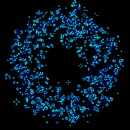

# life


> **[View the demo](https://semibran.github.io/life/)**

Any [cellular automaton](https://en.wikipedia.org/wiki/Cellular_automata) with rules [similar to](https://en.wikipedia.org/wiki/Life-like_cellular_automaton) [Conway's Game of Life](https://en.wikipedia.org/wiki/Conway's_Game_of_Life) can be modeled using a data structure similar to the following:
```js
let world = {
  time: 0
  rule: { birth: [ 3 ], survival: [ 2, 3 ] }
  size: [ 256, 256 ]
  data: new Uint8ClampedArray(256 * 256)
    .fill()
    .map(_ => Math.random() < 0.25)
}
```
The update function found in `lib/update.js` efficiently advances the given `world` by a single unit of time. Altering the rule, size, and seed of the above structure would enable you to simulate any cellular automaton with Life-like mechanics.

## license
[MIT](https://opensource.org/licenses/MIT) © [Brandon Semilla](https://git.io/semibran)
